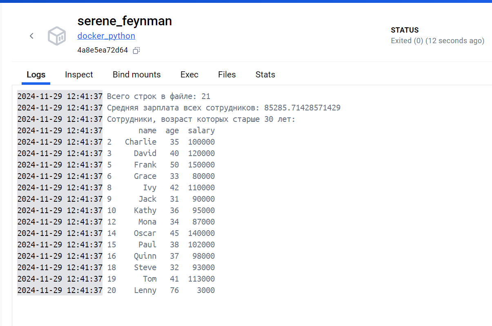

# Курс "Архитектор данных".

## Задание 4

Создание Docker-контейнера с Pandas

Цель: Научиться создавать Docker-контейнер с Python-приложением, которое выполняет анализ данных с использованием библиотеки Pandas. В этом приложении будет произведен расчет средней зарплаты и выборка сотрудников старше 30 лет.

Описание задания:

    Создайте директорию для проекта и необходимые файлы.
    Создайте файл data.csv с примерными данными о сотрудниках. 
    Убедитесь, что в файле не менее 20 строк.

# Выполнение задания.

## В терминале перейдите в директорию проекта и выполните:

1. **Сборка Docker-образа:**
   - Команда: `docker build -t docker_python .` - создает новый Docker-образ на основе инструкций, указанных в 
   Dockerfile, который находится в текущей директории (обозначенной точкой `.`). Флаг `-t` позволяет задать тег для 
   создаваемого образа, в данном случае — `docker_python`. Это имя будет использоваться для ссылки на образ в 
   последующих командах.

2. **Запуск контейнера:**
   - Команда: `docker run -d docker_python` запускает новый контейнер на основе ранее созданного образа `docker_python`,
   контейнер должен работать в фоновом режиме (detached mode).

3. **Просмотр логов контейнера:**
   - Команда: `docker logs <container_id>` - вы можете просмотреть логи работы вашего контейнера. `<container_id>` 
   следует заменить на фактический идентификатор (ID) вашего контейнера, который вы можете получить с помощью команды 
   `docker ps` (для просмотра запущенных контейнеров).

### Результат:

